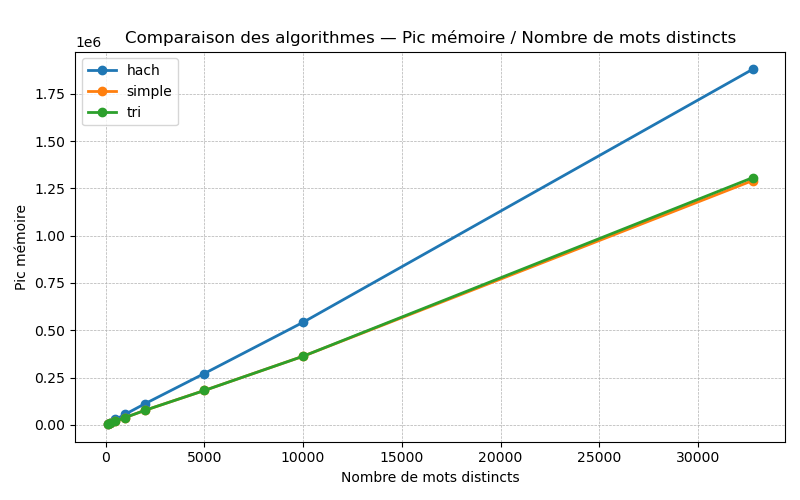
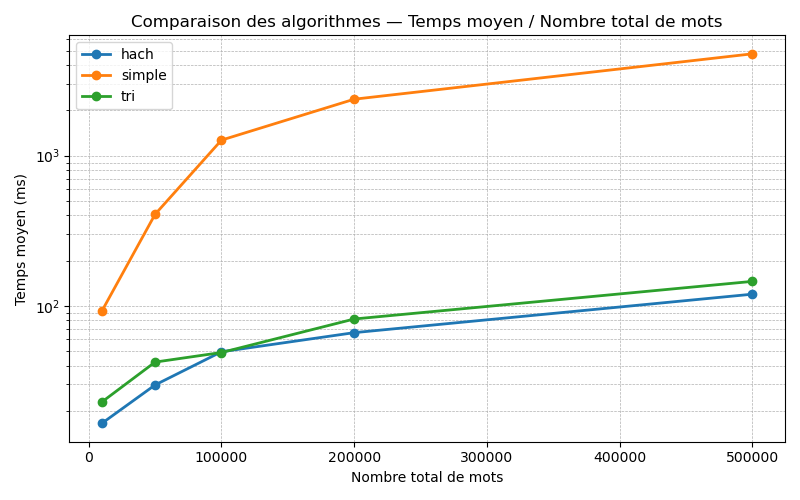
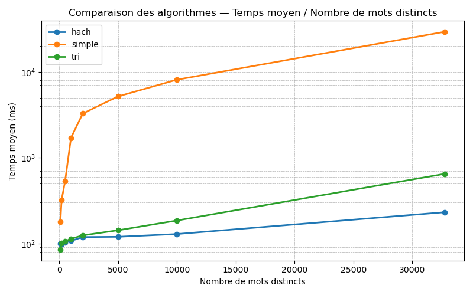

# Initiation à la programmation C
# Projet du semestre 3 
## Nombre d’occurrences des mots d’un texte
## Comparaison d’algorithmes

TD double-licences   
Amaury Coquelin et Camille Galy Sagrasta  
Rendu du 06/01/2026

<div style="page-break-after: always;"></div>

## Contenu du fichier
* Un fichier readMe.txt détaillant le lancement du programme.
* Un fichier main.c contenant le coeur du programme.
* Un fichier gererMem.c contenant la structure pour étudier la mémoire et les fonctions d'allocation ou de désallocation y faisant appel.
* Des fichiers xxhash.c et xxhsh.h permettant l'utilisation d'une fonction de hachage.
* Un dossier textes avec les fichiers textes utilisés par les algorithmes.
* Un dossier performancesDiffFixe avec des fichiers de performance générés par le programme dont le nombre de mots différents est identique pour chaque texte. Ces fichiers sont utilisés afin de générer des graphiques de performance.
* Un dossier performancesTotalFixe. Idem, cependant cette fois c'est le nombre de mots totaux qui est identique pour chaque texte.
* Un fichier graphiqueMotsCourants.py permettant comme son nom l'indique de générer un graphique des mots les plus courants à partir d'un fichier texte de résultats généré par le programme de main.c.
* Un fichier graphiquesAlgos permettant de générer des graphiques des performances des algorithmes. Attention, les fichiers utilisés doivent être dans le dossier performancesDiffFixe ou performancesTotalFixe.

<div style="page-break-after: always;"></div>

## Algorithmes utilisés

### Structure générale 
Une structure générale à été adoptée dans chaque algorithme afin de représenter un mot et son nombre d'occurences.

```
typedef struct occMot{
    char * mot;
    int occurrence;
} OccMot;
```
Une structure Liste est également commune :
```
typedef struct liste{  
    OccMot * occmot;  
    int tailleLst; //Espace occupé  
    int tailleMax; //Espace alloué  
} Liste;
```

A la fin du programme on obtient une Liste contenant le nombre d'occurence de chaque mot du texte.  
Afin de renvoyer un résultat trié par nombre d'apparition des mots un tri fusion est effectué.  
La complexité de celui-ci est en o(nlog(n)), il est gourmand en espace mémoire bien que très efficace.  

### Liste non triée

Cet algorithme est basé uniquement sur l'utilisation de la structure Liste.  

1. Utilisation du temps :  
A chaque nouveau mot rencontré la liste est parcourue intégralement afin de déterminer si celui-ci est déjà présent.  
Lors de la création de la liste on distingue 2 cas de figure :  
    - Le mot est déjà dans la liste, simple recherche :  
        On parcourt les éléments un à un : o(n).
    - Le mot n'est pas dans la liste, il faut l'ajouter :  
        On fait une recherche (mais ne trouve pas le mot) et l'ajoute donc à la fin, donc o(n) + o(1) donc o(n).  

->  Chaque mot croisé dans le texte entraîne donc une opération en o(n).  

2. Utilisation de la mémoire :    
La mémoire occupée dépend du nombre de mots différents du texte et non du nombre réel de mots du texte.  
La taille étant double à chaque fois l'espace occupé par la Liste d'OccMot sera au maximum 2 fois la taille d'OccMot multiplié par le nombre de mots différents du texte.  


### Liste triée
L'algorithme utilisant une liste triée reprend la structure de Liste précédente mais en veillant à conserver un tri alphabétique. 
1. Utilisation du temps :  
Le fait d'avoir une liste triée permet de grandement améliorer l'efficacité de l'algorithme d'un point de vue complexité :  
Lors de la création de la liste on distingue 2 cas de figure :  
    - Le mot est déjà dans la liste, simple recherche :  
        On effectue une recherche dichotomique qui est en o(logn).  
    - Le mot n'est pas dans la liste, il faut l'ajouter :  
        On effectue une recherche dichotomique puis insère dans le tableau à la bonne place en décalant les éléments suivants, o(log(n)) + o(n) donc o(n).  

-> La majorité des textes contenant de nombreux mots plusieurs fois la plupart des appels sera en o(log(n)) et certains seront seront en o(n).  


2. Utilisation de la mémoire :   
L'utilisation de mémoire est strictement identique à celle de l'algorithme utilisant une liste non triée.

### Table de hachage
Pour cet algorithme une structure de table de hachage à été utilisée :
```
typedef struct table_h{
    int capacite; //Taille de la table
    int occupation; //Nombre de cases occupées
    OccMot ** occmot; //Liste de pointeurs
} Table_h;
```
Il a été choisi d'utiliser une table de hachage interne. En effet l'algorithme ayant pour but de simplement ajouter des mots aucune suppression n'a lieu ce qui rend plus simple l'implémentation d'une table interne.  

L'algorithme utilise la fonction de hachage xxhash importée grâce à xxhash.c et xxhash.h.  

1. Utilisation du temps :  
La complexité d'un algorithme utilisant une table de hachage dépend du nombre de collision, ici la taille de la table est doublée lorsque le facteur de charge est supérieur ou égal a 75%.  
La complexité des operations de recherche et d'ajout est alors un complexité amortie en moyenne en o(1).  
Une fois la table de hachage finale obtenue celle-ci est convertie en liste afin de pouvoir utiliser l'algorithme de tri fusion pour avoir un résultat triée selon le nombre d'occurence des mots. La fonction "tableHach_to_lst" est en o(n) puisqu'elle parcourt chaque case de la table de hachage.  

2. Utilisation de la mémoire :  
La table de hachage prend potentiellement plus de place en mémoire que les Listes précédentes car sa taille double afin de rester au moins à 25% vide. De plus, une liste est aussi allouée afin de pouvoir trier le résultat obtenu. Cette liste est de la taille minimale nécessaire (c'est à dire le nombre de mots différents du texte).  
Il y a donc plus de mémoire utilisée que lors des 2 algorithme précédents. 

## Comparaison des performances observées

1. Utilisation mémoire pour des textes similaires:  
L'utilisation de mémoire est similaire pour les listes simples ou triées.  
Cette utilisation mémoire dépend du nombre de mots différents mais pas du nombre de mots totaux du texte.
     - Espace mémoire alloué au total :  
hachage > liste  
     - Pic d'espace mémoire alloué :  
hachage > liste  
  
Les trois algorithmes aboutissent à un pic d'utilisation mémoire linéaire. Cependant, la table de hachage utilise bien plus de mémoire.
     - Espace mémoire toujours alloué à la fin de l'algorithme :   
     liste > hachage  
     En effet, la table de hachage est libérée de la mémoire et l'on ne conserve qu'une liste de taille minimale (nombre de mots différents dans le texte).  

2. Utilisation du temps :  
hachage < liste triée < liste simple  
Le temps dépend du nombre de mots totaux ainsi que du nombre de mots différents.  
  
  

<div style="page-break-after: always;"></div>

## Organisation du travail

### Conception des algorithmes
Nous avons tout d'abord réfléchi ensemble aux algorithmes semblant les plus intéressants et efficaces.  
Après avoir validée l'idée générale l'un des 2 à pris en charge l'algorithme, après des étapes intermédiaires d'écriture de pseudo-code ou de schématisation dessinées nous sommes passés au codage des fonctions.  


## Organisation du groupe
Beaucoup d'échange à eu lieu via messages durant les vancances de Noël ainsi que des échanges de codes à l'aide de Github.  

Contributions en pourcentage des membres du groupe :
* Amaury : 50 %
* Camille : 50 %

Algorithmes implémentés :
* Amaury : liste triée
* Camille : liste classique et table de hachage  


